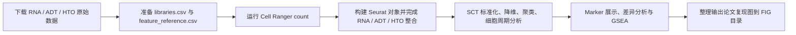

# Reproduce-NC

> 基于 Nature Communications 2021 论文的 B 细胞多组学单细胞测序复现项目，覆盖原始数据下载、Cell Ranger 计数、Seurat 下游分析和论文图形整理。

## 项目简介

本仓库用于复现论文 **Single-cell multi-omics reveals the genetic programs of B cell development** 中与 B 细胞发育相关的多组学单细胞分析流程。项目从原始 RNA / ADT / HTO 数据准备开始，经过 Cell Ranger 定量后，在 R / Seurat 中完成归一化、聚类、细胞类型注释、marker 展示与 GSEA 分析，并将主要图形整理到 `FIG/` 目录。

参考论文：

- [Single-cell multi-omics reveals the genetic programs of B cell development](https://www.nature.com/articles/s41467-021-27232-5)

## 流程概览



## 仓库结构

```text
.
├── 00_config.env              # 路径与线程配置
├── 01_download.sh             # 下载 FASTQ 与参考基因组
├── 02_make_csv.sh             # 生成 Cell Ranger 所需 CSV 配置
├── 03_run_cellranger.sh       # 运行 cellranger count
├── Ranalyze/                  # Seurat 下游分析脚本
│   ├── Control.R
│   ├── Control_a.R
│   └── clear.R
├── FIG/                       # 复现得到的主要图形输出（以 PDF 为主）
└── README.md
```

## 脚本职责

| 文件 | 作用 |
| --- | --- |
| `00_config.env` | 定义根目录、数据目录、元数据目录、参考基因组目录和线程数 |
| `01_download.sh` | 下载 RNA / ADT / HTO FASTQ 以及 10x mm10 参考基因组 |
| `02_make_csv.sh` | 生成 `libraries.csv` 与 `feature_reference.csv` |
| `03_run_cellranger.sh` | 处理 FASTQ 命名并运行 `cellranger count` |
| `Ranalyze/Control.R` | 读取 Cell Ranger 输出矩阵，构建 Seurat 对象并完成多组学整合 |
| `Ranalyze/Control_a.R` | 直接读取 GEO 原始计数矩阵进行复现分析 |
| `Ranalyze/clear.R` | 基于 `bcell.rds` 统一生成聚类图、marker 图、热图和 GSEA 图 |

## 环境要求

### Shell / 上游处理

- Linux 环境
- `wget`
- `fastp`
- `tar`
- `cellranger` 9.0.1

### R / 下游分析

- `Seurat`
- `SeuratObject`
- `SCTransform`
- `Matrix`
- `ggplot2`
- `patchwork`
- `dplyr`
- `biomaRt`
- `clusterProfiler`
- `msigdbr`
- `data.table`

## 运行方式

### 第一步：准备路径配置

仓库通过 `00_config.env` 统一管理路径。默认变量包括：

- `ROOT`
- `DATA`
- `FASTQ`
- `META`
- `REF`
- `SOFT`
- `THREADS`

建议先根据本地机器环境检查这些目录是否已经创建完成。

### 第二步：上游数据处理

1. 下载 RNA / ADT / HTO FASTQ 与参考基因组：

```bash
bash 01_download.sh
```

2. 生成 Cell Ranger 所需配置文件：

```bash
bash 02_make_csv.sh
```

3. 运行 Cell Ranger 计数：

```bash
bash 03_run_cellranger.sh
```

### 第三步：下游分析

本仓库提供两条分析路径：

- 路径 A：直接使用 GEO 原始计数矩阵，运行 `Ranalyze/Control_a.R`
- 路径 B：使用自己通过 Cell Ranger 得到的 `filtered_feature_bc_matrix`，运行 `Ranalyze/Control.R`

统一绘图和高级分析入口为：

```bash
Rscript Ranalyze/clear.R
```

## 主要产物

### 中间结果

- `Bcell/output/Bcell_count/outs/filtered_feature_bc_matrix`
- `Ranalyze/bcell.rds`

### 图形输出

主要图形保存在 `FIG/` 目录，按图号拆分为多个子目录：

- `FIG/fig1/`：全局降维、细胞周期与基础特征展示
- `FIG/fig2/`：Prepro B 与 Cycling Pro B 的对比结果
- `FIG/fig3/`：PreBCR 相关 marker 与 GSEA 结果
- `FIG/fig4/`：preBCR 不同状态的 marker 与高亮结果
- `FIG/fig5/`：VDJ 与成熟相关基因展示

## 推荐查看的结果文件

如果你想快速判断复现质量，建议优先查看以下图：

- [UMAP clusters](FIG/fig1/01_umap_clusters.pdf)
- [RNA marker panel](FIG/fig1/01_feature_RNA_panel.pdf)
- [Prepro vs Cycling Pro heatmap](FIG/fig2/02_heatmap_prepro_vs_cyclingPro.pdf)
- [PreBCR GSEA](FIG/fig3/03_Hallmark_GSEA_4paths.pdf)
- [Four preBCR states heatmap](FIG/fig4/04_heatmap_four_preBCR_states.pdf)
- [VDJ genes](FIG/fig5/05_feature_VDJ_genes.pdf)

## 复现注意事项

- `README` 现在已经说明了整体流程，但仓库中的部分脚本仍然保留了原始分析时使用的**绝对路径**，例如 `~/NC/...` 或特定服务器目录，重新运行前需要按本地环境调整。
- `clear.R` 默认读取 `Ranalyze/bcell.rds`，因此需要先完成 `Control.R` 或 `Control_a.R` 中的一条路径。
- `FIG/` 目录中的结果文件目前以 **PDF** 为主，更适合归档和打印；若要在网页中进一步展示，可后续补充 PNG 缩略图版本。

## 建议阅读顺序

1. 先看本 README，明确是走 GEO 复现路径还是 Cell Ranger 复现路径。
2. 再看 `00_config.env`、`01_download.sh`、`02_make_csv.sh`、`03_run_cellranger.sh`，了解上游数据流。
3. 接着看 `Ranalyze/Control.R` 或 `Ranalyze/Control_a.R`，理解 Seurat 对象是如何构建的。
4. 最后查看 `Ranalyze/clear.R` 与 `FIG/` 目录，快速对应论文中的主要结果图。
